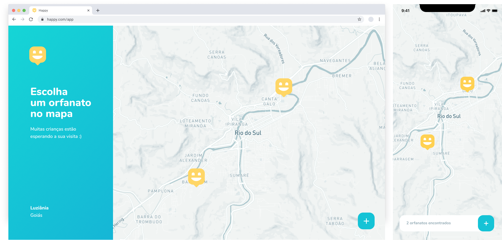

<h1 align="center">
  
   
  
  
  
  
  
</h1>

  <a href="#page_facing_up-links">Links</a>&nbsp;&nbsp;&nbsp;|&nbsp;&nbsp;&nbsp;
  <a href="#clipboard-descrição">Descrição</a>&nbsp;&nbsp;&nbsp;|&nbsp;&nbsp;&nbsp;
  <a href="#-tecnologias">Tecnologias</a>&nbsp;&nbsp;&nbsp;|&nbsp;&nbsp;&nbsp;
  <a href="#clipboard-Funcionalidades">Funcionalidades</a>&nbsp;&nbsp;&nbsp;|&nbsp;&nbsp;&nbsp;
  <a href="#-license">Licença</a>

## :page_facing_up: Descrição
Na Next Level Week #3 by @Rocketseat, criamos esta aplicação chamada Happy, que conecta as pessoas a casas de acolhimento institucional para fazer o dia de muitas crianças mais feliz. Durante essa semana criamos o Backend, Frontend e o app Mobile, foi uma semana intensa com muito apredizado e mão no código, para alcançar o próximo nível :rocket:

## :paperclip: Links
Nos links abaixo você encontra o Layout da versão Web e a versão Mobile, também um link para o google drive da Workspace do Insomnia, caso você queira testar a API.

- [Layout Web](https://www.figma.com/file/mDEbnoojksG4w8sOxmudh3/Happy-Web?node-id=0%3A1)
- [Layout Mobile](https://www.figma.com/file/X27FfVxAgy9f5IFa7ONlph/Happy-Mobile?node-id=0%3A1)
- [Workspace Insomnia](https://drive.google.com/file/d/1wTJnyg-1pjkz-RJUTS4ioyUfZHGZqNdP/view?usp=sharing)

## 🛠 Tecnologias
Este projeto foi desenvolvido com as seguintes tecnologias

- [Node.js](https://nodejs.org/en/)
- [React.js](https://pt-br.reactjs.org/)
- [React Native](https://reactnative.dev/)
- [TypeScript](https://www.typescriptlang.org/)
- [TypeORM](https://typeorm.io/#/)
- [Postgresql](https://www.postgresql.org/)
- [Expo](https://expo.io/)
- [StyledComponents](https://styled-components.com/)

## :clipboard: Funcionalidades
- [x] Visualizar todas as casas de acolhimento institucional cadastrados na aplicação.
- [x] Ver detalhes de cada casa de acolhimento institucional.
- [x] Criar uma casa de acolhimento institucional.
